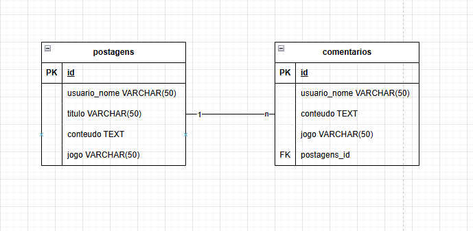

# Forum SoulsLike

# Descrição do Projeto
O Fórum de Jogos Souls-like é uma plataforma onde fãs de jogos Souls-like podem compartilhar dicas, discutir sobre batalhas, explorar teorias e trocar experiências de gameplay. O diferencial do sistema é que os usuários podem postar e comentar sem a necessidade de criar uma conta: eles escolhem um nome de usuário temporário a cada postagem ou comentário, permitindo participação rápida e anônima.

Esse fórum é voltado para quem gosta de jogos desafiadores como Dark Souls, Bloodborne, Sekiro, Elden Ring, entre outros.

# Recursos Principais
Postagens de Usuários sem Cadastro: Os usuários podem postar conteúdo com um nome temporário, sem criar uma conta.
Comentários nas Postagens: Outros usuários podem comentar em cada postagem, também escolhendo um nome temporário a cada comentário.

# Público-Alvo
O fórum é voltado para jogadores que desejam compartilhar e absorver conhecimento sobre jogos Souls-like, sem precisar se registrar.

# Tecnologias Utilizadas

Backend: PHP puro
Frontend: js,html e css puro
banco de dados: MySQL

# Diagrama

